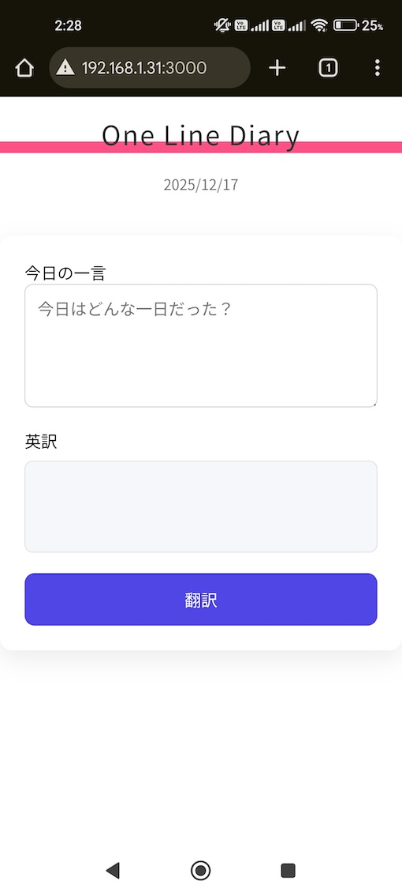
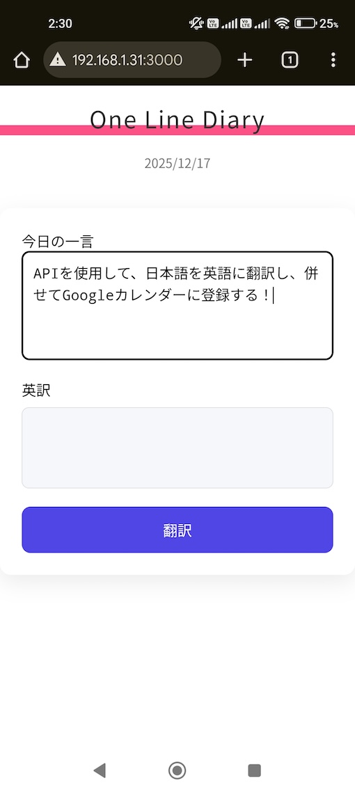
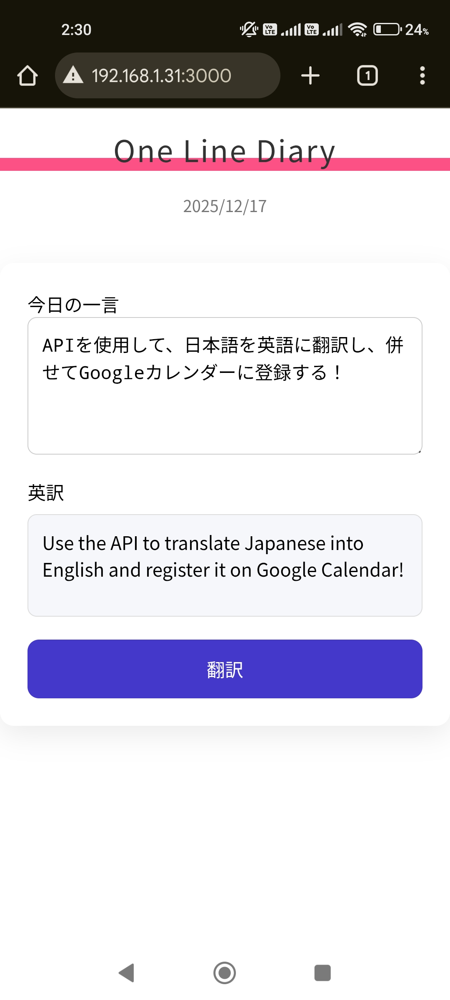
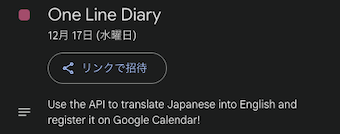

# One Line Diary(ひとこと日記)

※ API 連携はローカル環境でのみ動作します。

## 1.制作物の説明

ひとこと日記アプリを作成。以下 API を使用し日本語 → 英語に翻訳し、Google カレンダーへ登録する

- Google Cloud Translation API 　 → 翻訳で使用
- Google Calendar API（OAuth 2.0）→ カレンダー登録で使用

### 初期表示画面 | 今日の一言を入力 | 翻訳ボタンを押すと翻訳

  
  
  

### 併せて Google カレンダー側へ登録

## 2.工夫した点・こだわった点

- 複数の API を使用できたこと。
- Node.js、Express を API サーバーとして使用。
- dotenv でキーを変数管理

## 3.次回トライしたこと（または機能）

- 翻訳言語の切り替え
- AI の活用。週一回の振り返りコメントや自身の分析で使用したい。
